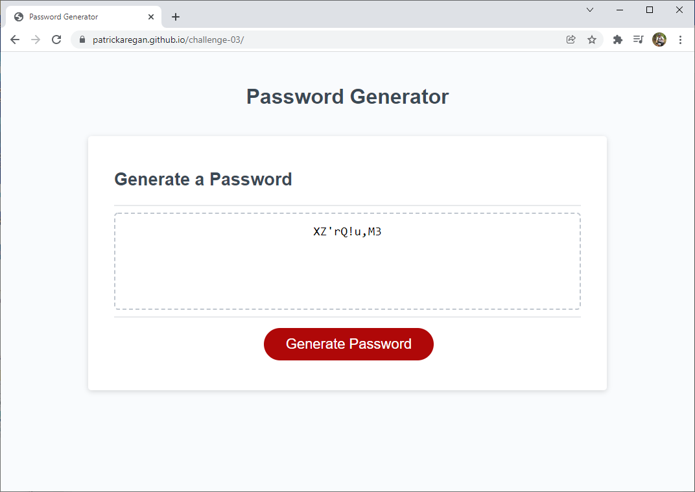

# patrickaregan.github.io/challenge-03/

## Description
- This project is a password generator built with HTML, CSS and JavaScript. It asks for five
pieces of information to generate a password. The first is the length of the password between
8 and 128 characters. The second through fifth questions are whether to include lowercase,
uppercase, numeric or special characters.
- A complex password generator is necessary today as we do so much online and need many different
passwords. It can be challenging to think up a password that is completely random so a password generator
is helpful.
- I learned about JavaScript in class and made use of objects and functions to complete this project. I also learned about the Issues functionality in GitHub and used that to list out all the Acceptance Criteria and closed each issue when I completed that functionality.
- I used functions to prompt for password criteria and stored all the selections in an object.
- Using an object for the password criteria kept my code cleaner and more orgainzed.
- The functions made it easy to call logic again if any of the requirements were not met. For example, I checked if at least one character type was selected and if not I started the prompting over again by calling the generatePassword function again.
- For the password generation I created two arrays, a character array and a password array. The character array holds all the characters from all the character types selected in the prompting phase. For example if the user selected lowercase and uppercase then I put both those character sets in the character array. That made them all available to be chosen randomly. Then I created a loop for as many times as the password length the selected by the user and randomly picked a character from the character array and put it in the password array. This worked very well but I had to go one step further to validate that the password array contained at least one character from every character type the user selected.
- To validate the password array I created a password validation function that looped through all the character types the user selected and looked for each character in the password array. I stored the count in a counter and if there was at least one for each type selected then I marked the password valid.
- The final step was to turn the password array into a string so I could display it to the user. I used the join function with an empty string as argument to turn the array into a string.

## Screenshot

## Link
[https://patrickaregan.github.io/challenge-03/](https://patrickaregan.github.io/challenge-03/)

## Credits

UT Coding Bootcamp. (January 14, 2022). Random number function.
Retrieved January 14, 2022,
from [https://courses.bootcampspot.com/courses/925/pages/3-dot-4-4-use-the-math-object?module_item_id=399356](https://courses.bootcampspot.com/courses/925/pages/3-dot-4-4-use-the-math-object?module_item_id=399356)